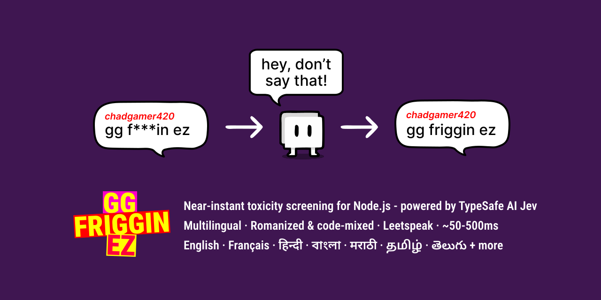

<div align="center">


<h1>gg-friggin-ez</h1>

<p><strong>Fast, drop-in profanity and toxicity screener for Node.js, powered by <a href="https://typesafe.ai/blog/introducing-system-one-models-and-jev">TypeSafe AI Jev</a>.
</strong>
</p>

<p>
<strong>
Fast. Cheap. Catches the friggin crap.
</strong>
</p>

<p>
  <a href="#quick-start">Quick Start</a> |
  <a href="#install">Install</a> |
  <a href="#the-problem--the-solution">The Problem & The Solution</a> |
  <a href="#interactive-browser-demos">Demos</a> |
  <a href="#custom-schemas">Custom Schemas</a>
</p>

[](https://www.npmjs.com/package/gg-friggin-ez)
[](LICENSE)

⭐ _Help us reach more developers and grow the community. Star this repo!_

</div>

<p align="center">
  
</p>

Works across languages and scripts, with zero training required.

Real-world chat isn't clean. Users switch scripts, write regional languages in Latin characters, add spaces between letters, and turn profanity into leetspeak. **gg-friggin-ez** is built for exactly these cases - detecting romanized profanity, code-mixed text, leetspeak, and character spacing across languages including Kannada, Telugu, Tamil, Hindi, and Bengali.

All at ~50-500ms latency, making it suitable for real-time chat and game moderation without reaching for a general-purpose LLM.

## The Problem

Static keyword denylists and generic moderation APIs fail on real-world user-generated content (social posts, comments, reviews, live chat, and in game text comms):

- **Evasion & Leetspeak**: Common obfuscation tricks bypass static keyword denylists.

| Technique                  | Examples                                                                                    |
| -------------------------- | ------------------------------------------------------------------------------------------- |
| **Symbol / number swaps**  | `$hitt3r` · `p00da` · `b$dk` · `m1erda` · `c0nnard` · `傻x / c*m` · `死○ね / sh1ne`         |
| **Spaced characters**      | `p a i t h i y a m` · `b s d k` · `m i e r d a`                                             |
| **Character stretching**   | `looooosuuu` · `paaaagal` · `菜逼逼逼` · `死ねぇぇぇ`                                       |
| **Mixed-script**           | `chuतिya` · Latin + native-script characters                                                |
| **ASCII / visual evasion** | Hostile gestures rendered with punctuation, e.g. ASCII middle fingers, that even LLMs miss. |

> Examples span English, Tamil, Hindi, Spanish, French, Chinese, Japanese, and other languages.

- **Romanized & Code-Mixed Languages**: Transliterated text has no standard spelling and freely blends multiple languages.

| Language               | Example                                                      | Variations                                    |
| ---------------------- | ------------------------------------------------------------ | --------------------------------------------- |
| **English**            | `you are an absolute piece of <ins>sh1t</ins>, stop talking` | `shit` · `$hit` · `sh*t`                      |
| **Hindi / Hinglish**   | `abe <ins>chutiya</ins> chup kar na`                         | `chootiya` · `chutya` · `chuतिya` · `c***iya` |
| **Tamil / Tanglish**   | `nee oru <ins>pooda</ins> paithiyakaara da`                  | `p00da` · `puda` · `puuda`                    |
| **Kannada / Kanglish** | `nin <ins>huccha</ins> naye tara adtiya`                     | `huchcha` · `hu$ha` · `hucha`                 |
| **Japanese / Romaji**  | `omae hontou ni <ins>shine</ins> yo gomi`                    | `shiИe` · `sh1ne` · `死ね` · `死○ね`          |

- **Regional sparsity:** Non-Hindi regional languages suffer from limited training data and dialectal variation, challenging keyword lists and off-the-shelf classifiers ([DravidianCodeMix](https://doi.org/10.1007/s10579-022-09583-7)).

- **Identity-Based Hate Speech:** Regional caste, gender, and religious harassment can be difficult for English-centric moderation systems to detect, especially in transliterated or code-mixed text - e.g. _"kitchen me jaake khana bana ladki, games tere bas ka nahi"_.

- **False-Positive Traps**: Harmless friendly banter, cultural idioms, or casual slang get wrongly flagged as severe abuse by blunt keyword matchers.
- **LLMs are slow & expensive:** General-purpose LLMs can take 1-3s just to produce the first token, making real-time moderation slow and costly at scale.

## The Solution

`gg-friggin-ez` uses **TypeSafe AI Jev** as a reflex-speed System One decision (classifier) engine:

- **Reflex Speed**: ~50-500ms end-to-end response time.
- **Low Cost**: $0.042 / 1M input tokens, and no charge for output tokens.
- **Evasion-Aware**: Handles common obfuscation patterns including leetspeak, character spacing, romanization, and code-mixing.
- **Multilingual**: Supports English and Indic languages, including romanized/transliterated input.
- **Drop-In & Pluggable**: Simple Node.js API (`isProfane()`, `isToxic()`, `screen()`), with built-in screening rules, or bring your own custom schema.
- **Human Review Path**: Ambiguous/context-dependent cases can be routed for human review rather than forcing a binary decision.

## Install

```bash
npm install gg-friggin-ez
```

> Requires Node.js `18+` (or Bun). Ships as both ESM and CommonJS with bundled TypeScript types.

<details>
<summary>Other package managers</summary>

```bash
yarn add gg-friggin-ez
```

```bash
pnpm add gg-friggin-ez
```

```bash
bun add gg-friggin-ez
```

</details>

## Quick Start

```ts
import { isProfane, isToxic } from "gg-friggin-ez";

process.env.OPENROUTER_API_KEY = "sk-or-..."; // or call configure({ apiKey }) instead

// Fast boolean convenience checks
const profane = await isProfane("you are absolute dog sh1t"); // true
const toxic = await isToxic("you are completely brainless and useless"); // true

// Works with transliterated, code-mixed, and obfuscated text
const indic = await isProfane("Nee oru p00da paithiyakaara da, 5colo nadatha"); // true
```

Or `require()` it from plain CommonJS Node:

```js
const { isProfane, isToxic } = require("gg-friggin-ez");

const bad = await isProfane("you are absolute dog sh1t");
```

> [!TIP]
> **Performance tip**: Performance tip: `isProfane()` and `isToxic()` each trigger an inference request. If you need multiple moderation signals, call `screen()` once.

### Full detail

```ts
import { screen } from "gg-friggin-ez";

// Multi-vector adversarial evasion: spacing, leetspeak, repeated chars, symbols, & mixed script
const result = await screen(
  "Nee oru p 0 0 d a daaaa, b*dk chuतिya 5colo nadatha",
);

console.log(result);
// {
//   isProfane: true,
//   isToxic: true,
//   severity: "SEVERE",
//   severityScore: 1.95,
//   language: "tamil",
//   obfuscationType: "mixed_script",
//   obfuscationTypes: [
//     "mixed_script",
//     "spaced_characters",
//     "leetspeak",
//     "repeated_characters",
//   ],
//   action: "AUTO_BAN",
// }
```

`screen()` returns the complete moderation result:

- `isProfane` - `true` / `false` - explicit profanity or slurs
- `isToxic` - `true` / `false` - hostility, harassment, or personal attacks
- `severity` - `"NONE"` / `"MILD"` / `"SEVERE"`
- `severityScore` - continuous `0.0-2.0` score, e.g. `1.95`
- `language` - detected language, e.g. `"tamil"`
- `obfuscationType` - primary evasion technique, e.g. `"mixed_script"`
- `obfuscationTypes` - all detected evasion techniques, e.g. `["mixed_script", "spaced_characters", "leetspeak", "repeated_characters", "symbol_substitutions"]`
- `action` - `"ALLOW"` / `"SUSPICIOUS_REVIEW"` / `"AUTO_CENSOR"` / `"AUTO_MUTE"` / `"AUTO_BAN"`

### Visual Evasion & ASCII Art Screening

Standard keyword denylists and traditional NLP models process text as 1D token streams, and may miss 2D ASCII drawings. `gg-friggin-ez` detects ASCII-art evasion as a distinct moderation signal.

```ts
const asciiMiddleFinger = `
....................../´¯/) 
....................,/¯../ 
.................../..../ 
............./´¯/'...'/´¯¯\`·¸ 
........../'/.../..../......./¨¯\\ 
........('(...´...´.... ¯~/'...') 
.........\\.................'...../ 
..........''...\\.......... _.·´ 
............\\..............( 
..............\\.............\\...
`;

const res = await screen(asciiMiddleFinger);

console.log(res.obfuscationType); // "ascii_art"
console.log(res.obfuscationTypes); // ["ascii_art"]
console.log(res.severityScore); // 1.30
console.log(res.action); // "SUSPICIOUS_REVIEW"
```

### Configurable policy thresholds

You can customize the decision action thresholds per-call or across the shared screener.

```ts
const result = await screen("some borderline text", {
  thresholds: {
    review: 0.3, // route to review at >= 30% confidence
    censor: 0.55, // auto-censor at >= 55%
    ban: 0.7, // auto-ban at >= 70%
  },
});
```

### API key configuration

`gg-friggin-ez` reads the API key from environment variables (in order): `OPENROUTER_API_KEY`, `TYPESAFE_API_KEY`, `JEV_KEY`. You can also configure it explicitly.

```ts
import { configure } from "gg-friggin-ez";

configure({ apiKey: "sk-or-..." });
```

If no key is configured, `gg-friggin-ez` falls back to a local heuristic evaluator so calls never throw - but for production-grade accuracy you'll want a real API key.

### Custom schemas

Create an independent screener with your own Jev question schema - useful for a different language family, domain, or moderation policy.

```ts
import { createScreener } from "gg-friggin-ez";

const screener = createScreener({
  apiKey: "sk-or-...",
  questions: myCustomQuestions, // same shape as DEFAULT_TOXICITY_QUESTIONS
});

const result = await screener.screen("some text");
```

## Interactive Browser Demos

The repository includes two interactive simulations - **Twitch live chat** and **Valorant text comms** - showcasing real-time code-mixed toxicity detection. Run locally with Bun or host on **GitHub Pages**. Add an OpenRouter or TypeSafe AI API key via the **API Keys** modal, or use the built-in offline heuristic evaluator without a key.

### Twitch Live Stream Chat UI

<p align="center">
  
  <br>
  <sub>Live Twitch chat moderation with AutoMod timeout, language detection, and moderator reveal.</sub>
</p>

### Valorant Realtime Comms

<p align="center">
  
  <br>
  <sub>In-game tactical comms HUD with real-time censorship, 3-strike penalty system, and inline telemetry cards.</sub>
</p>

### Running the demo locally

Requires [Bun](https://bun.sh) (v1.1+).

```bash
git clone https://github.com/ItisShikhar/gg-friggin-ez.git
cd gg-friggin-ez
bun install

bun run demo
```

Open [http://localhost:3000](http://localhost:3000) in your browser.

### Running Tests

```bash
bun test
```

### Building the npm package

```bash
npm run build
```

Emits `dist/index.js` (ESM), `dist/index.cjs` (CJS), and `dist/index.d.ts` (types).

## How It Compares

How `gg-friggin-ez` compares on latency, multilingual coverage, and real-world evasion handling.

| Moderation Approach                                       | Latency       | Strengths                                                                                                                                            | Trade-offs                                                                                                          |
| :-------------------------------------------------------- | :------------ | :--------------------------------------------------------------------------------------------------------------------------------------------------- | :------------------------------------------------------------------------------------------------------------------ |
| **`gg-friggin-ez`** (TypeSafe AI Jev)                     | **~50-500ms** | Multilingual, including romanized/transliterated Indic languages (Tamil, Telugu, Kannada, Bengali, Hindi, etc.), evasion tricks (leetspeak, spacing) | Limited conversational context (routes to human review)                                                             |
| **Perspective API** (Google Jigsaw)                       | ~80-120ms     | Monolingual English, Spanish, standard Hindi (`hi`)                                                                                                  | Unsupported on Dravidian & regional Indic languages. Scheduled to sunset end of 2026.                               |
| **OpenAI Moderation Endpoint** (`omni-moderation-latest`) | ~150-350ms    | Multilingual standard text (40 languages supported with major gains in Telugu, Bengali, Marathi)                                                     | Fixed 13 harm categories rather than custom policy schemas; higher false-positive rate on casual colloquial banter. |
| **Custom BERT / FastText**                                | ~15-30ms      | Extremely fast; performance depends on training data                                                                                                 | Requires training data + maintenance.                                                                               |
| **General LLMs (GPT-4o)**                                 | 1,000-3,500ms | Has multilingual world knowledge                                                                                                                     | 10x to 30x latency, plus 100x inference cost.                                                                       |

## Benchmark Results

Results from 42 curated test cases across 14 languages, covering multilingual, romanized, and obfuscated text.

| Metric                            | `gg-friggin-ez` (TypeSafe AI Jev) | OpenAI (`omni-moderation`) | Perspective API                    | Legacy Keyword Filter |
| :-------------------------------- | :-------------------------------- | :------------------------- | :--------------------------------- | :-------------------- |
| **Overall Accuracy**              | **97.6%** (41 / 42)               | 88.1% (37 / 42)            | 38.1% (16 / 42) _(18 unsupported)_ | 61.9% (26 / 42)       |
| **Romanized Indic Accuracy**      | **94.4%**                         | 77.8%                      | 16.7%                              | 66.7%                 |
| **Global Languages Accuracy**     | **100%**                          | 100%                       | 72.2%                              | 55.6%                 |
| **Obfuscated Evasion Catch Rate** | **100%**                          | 71.4%                      | 28.6%                              | 35.7%                 |
| **Average Measured Latency**      | **~105ms** _(direct engine)_      | ~210ms                     | ~110ms                             | <1ms                  |
| **Inference Cost**                | **~$0.000052 / msg**              | Free                       | Free _(sunset 2026)_               | $0.00                 |

> _Latency Note_: Direct `gg-friggin-ez` engine latency is ~105ms (reflecting raw OpenRouter proxy transit minus the ~265ms external network hop).

> _Note on API language coverage:_ According to Google's official [Perspective API documentation](https://github.com/conversationai/perspectiveapi), its `TOXICITY` model officially supports only 18 languages - with standard Hindi (`hi`) and experimental Hinglish (`hi-Latn`) being its only Indic coverage. Tamil, Telugu, Kannada, Bengali, Marathi, and Bhojpuri are unsupported.

> For complete itemized data across all 42 tests, individual scores, and latency logs, see [raw-benchmarks.md](./raw-benchmarks.md).

## Contributing

Contributions are welcome, whether they improve performance, fix bugs, add
presets, components or effects, expand examples and tests, or improve documentation.
See [Contributing](CONTRIBUTING.md) before opening a pull request.

## Author

Built by [Shikhar Srivastava](https://www.linkedin.com/in/itisshikhar/).

[GitHub](https://github.com/ItisShikhar) ·
[LinkedIn](https://www.linkedin.com/in/itisshikhar/)

## License

gg-friggin-ez is released under the [MIT License](LICENSE).
